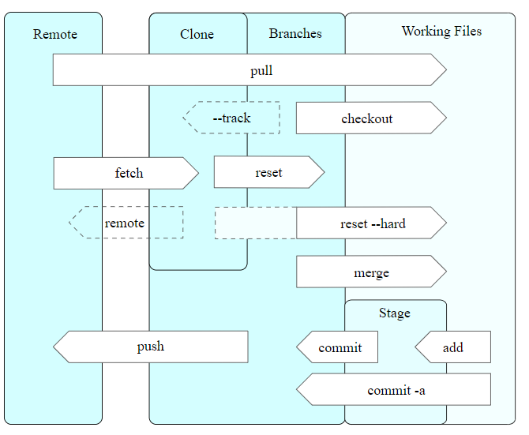

# Was ist Git?

🦄

    Git ist ein verteiltes Versionsverwaltungssystem für Dateien.
    Es ermöglicht es, ohne Zentralen server nicht-linear an Dateien zu arbeiten. 
    Hierdurch eignet es sich ideal, in einem Team an Softwareprojekten zu arbeiten.

# Was unterscheidet Git von anderen Versionsverwaltungssystemen? 

    Durch seine verteile Struktur und die Tatsache, dass es Open Source ist,
    ist git weit verbreitet. Es ist komfortabel in der Anwendung. Jedoch
    muss beachtet werden, dass im Gegensatz zu zentralisierten Systemen bei jedem
    Abbild der vollständige Änderungsverlauf des Original kopiert wird, sodass
    große Datenmengen entstehen können. Außerdem biete Properitäre Software spezielle
    Funktionen für bestimmte Anwendungsbereiche.

# Wichtige Begriffe und Befehle

### Repository

	Eine Spezielle Datenbank, entspricht einem digitalen Archiv, bei dem die Daten und deren Historie erfasst und gespeichert werden.

### Branch

	Ein Zweig in dieser Historie

### Fork
	
	Eine Abspalung eines Entwicklungszweig in der Softwareentwicklung

### git init

	Erstellt leeres Repository und initialisiert dieses

### git clone

	Initialisiert ein leeres Repository und kopiert Daten aus einem Quellrepository (z.B. Remote Repository über HTTP)
	in dieses. Hierzu wird ein neuer "Branch" "geforked", d.h. ein unabhängier Zweig in Form des neuen Repositoies erstellt.
	Das neue Repository enthält eine Referenz auf die Origin.

### git commit

	Erfasst einen sicheren Status des aktuellen Projektstandes und speichert diesen. Hierbei wird nur die Änderung Arbeitskopie
	erfasst.

### git push

	Updated die Remote Referenz über die Lokale Referenz. Hierbei wird die Änderung des letzten Commits an das urpsrüngliche Repository
	weitergegeben.

## Netzbasierte Versionsverwaltung

    Es gibt einige formen von gehosteten Versionsverwaltungssystemen, die Git nutzen. Hierbei wird dieses i.d.R. mit GUI und vielen 
    anderen Funktionen, wie DevOps-Einbindung etc. verwendet. Bekannt sind hier vor allem GitHub und GitLab.

### GitHub

	Wurde 2008 von GitHub, inc. entwickelt und 2018 an Microsoft für 7,5Mrd. Dollar verkauft.
	Ist Marktführer und hat eine große Community.

	Es ist vor allem in der grundlegenden Infrastruktur relativ performant.

[Link](https://github.com/)

### GitLab

	GitLab hingegen ist open source, es wurde 2011 entwickelt und ist seit 2012 online.
	Es kann von jedem auf Servern genutzt werden, was es für viele Anwender interessant macht.

	GitLab hat weniger Limitierungen und mehr konfigurationsmöglichkeiten, darüber hinaus ist es modular
	und hierdurch gut skalierbar, sodass es bessser angepasst werden kann.

[Link](https://gitlab.com/)

> Autoren: Alexander Riedel, Kevin Goldmann, Oleksandr Cherniaiev, Jan Obernberger!
